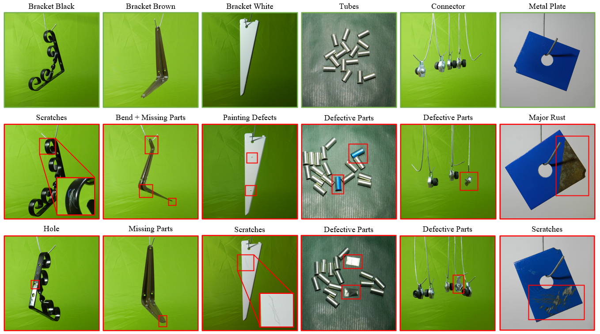

# Metal Parts Defect Detection Dataset (MPDD)

MPDD is a dataset aimed at benchmarking visual defect detection methods in industrial metal parts manufacturing. It consists of more than 1000 images with pixel-precise defect annotation masks. The dataset is divided into the training subset with anomaly-free samples and the validation subset that contains both normal and anomalous samples. The dataset can be downloaded at the following link.

<a id="raw-url" href="https://vutbr-my.sharepoint.com/:f:/g/personal/xjezek16_vutbr_cz/EhHS_ufVigxDo3MC6Lweau0BVMuoCmhMZj6ddamiQ7-FnA?e=oHKCxI">Download link</a>

## Paper
For more information about the dataset, see our paper at the <a id="raw-url" href="https://ieeexplore.ieee.org/abstract/document/9631567">following link</a>



## Citing
If you use the dataset in this repository, please cite
```
@INPROCEEDINGS{9631567,
  author={Jezek, Stepan and Jonak, Martin and Burget, Radim and Dvorak, Pavel and Skotak, Milos},
  booktitle={2021 13th International Congress on Ultra Modern Telecommunications and Control Systems and Workshops (ICUMT)}, 
  title={Deep learning-based defect detection of metal parts: evaluating current methods in complex conditions}, 
  year={2021},
  volume={},
  number={},
  pages={66-71},
  doi={10.1109/ICUMT54235.2021.9631567}
}

```

## Contant to authors
For more information, please contact us by email.

Stepan Jezek: <a href="mailto:Stepan.Jezek1@vut.cz">Stepan.Jezek1@vut.cz</a>
Radim Burget: <a href="mailto:burgetrm@vutbr.cz">burgetrm@vut.cz</a>

## Acknowledgments

This work was supported by project "Defectoscopy of painted parts using automatic adaptation of neural networks", FW03010273, Technology Agency of the Czech Republic

<a id="raw-url" href="https://www.vut.cz/en/">Brno University of Technology</a>
